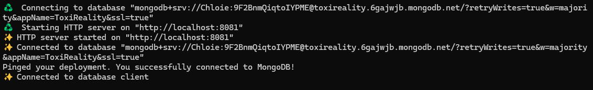

# Toxi_API

**Thème de l'application** : API express typescript

**Contexte** : Projet Universitaire. Il s'agit de l'API de notre SAE de troisième année ToxiReality. Cette dernière nous permet de faire le lien entre notre base de donnée Mongo, notre code IA et l'hololens. 

## Description du repository

## Lancer le Projet

Pour lancer le projet, vous devez disposer de la dernière version de node sur votre PC. 
[Lien pour télécharger node](https://nodejs.org/en/download)

Vous devez aussi mettre npm à jour si vous l'avez déjà sur votre PC.
``` npm install -g npm@latest ``` 

Avant de pouvoir lancer l'application, il vous faudra créer un fichier .env à la racine de l'API.
Ce dernier doit être un copier-coller du fichier .env.exemple.
Vous devrez compléter le **MONGO_URL=** avec l'adresse de la base de donnée mongo. Cette dernière pourra vous être donné par un des 3 créateurs du projet ToxiReality.

Pour lancer le projet, utilisez la commande :
``` npm run dev ``` 

Si tout marche correctement, vous devrez voir les messages suivants:



# :construction_worker: Développeurs

- Nathan VERDIER : nathan.verdier@etu.uca.fr

<a href = "https://codefirst.iut.uca.fr/git/nathan.verdier">
</a>

- Lucie BEDOURET : lucie.bedouret@etu.uca.fr

<a href = "https://codefirst.iut.uca.fr/git/lucie.bedouret">
</a>

- Chloé MOURGAND : chloe.mourgand@etu.uca.fr

<div align="center">
<a href = "https://codefirst.iut.uca.fr/git/chloe.mourgand">
</a>

© IUT - Auvergne
</div>


